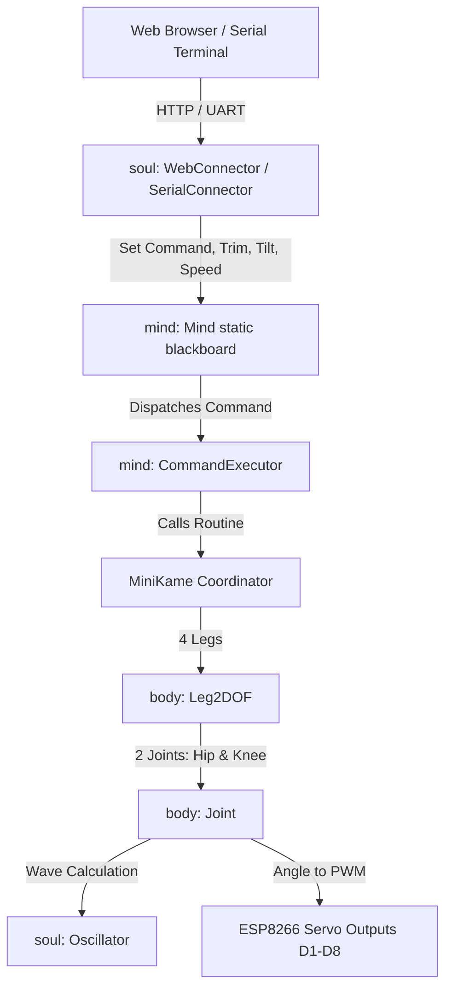

# AGENTS.md

## Project Overview

**FairyKame** (`fairyKame`) is an open-source firmware and hardware project for a 3D-printed quadruped (spider/lizard-style) robot.
- **Lineage:** FairyKame is a modular fork of [fatKame](https://github.com/Blomdoft/fatKame), which itself derives from Javier Isabel's [miniKame](https://github.com/JavierIH/miniKame).
- **Core Focus:** Clean, modular code organization designed to make it easy to create and customize robot gaits and poses, while supporting remote control over Wi-Fi (HTTP) and USB Serial. Ultrasonic sensor and autonomous roaming features from fatKame were removed to keep the scope focused and lightweight.

---

## Hardware Specifications & Pinout

- **Microcontroller:** ESP8266 (NodeMCU v2). *Note: ESP8266 lacks Bluetooth hardware; migration to ESP32 is tracked on the roadmap for native wireless Bluetooth Serial (SPP) control (see [TODO.md](TODO.md)). External adapters/modules (e.g. HC-05) are intentionally excluded.*
- **Toolchain / Build:** PlatformIO (`platform = espressif8266`, `board = nodemcuv2`, `framework = arduino`).
- **Actuators:** 8 micro-servos (2 DOF per leg: hip/spread and knee/height).
- **Chassis / Mechanicals:** 3D-printed parts located in `parts/scad/` and `parts/stl/`.

### Pin & Joint Assignments

| Leg | Joint | Pin | Direction | Default Function |
| :--- | :--- | :--- | :--- | :--- |
| **Front Left** | Hip (Spread) | `D1` | Clockwise | Lateral leg rotation |
| **Front Left** | Knee (Height) | `D8` | Clockwise | Vertical leg elevation |
| **Front Right** | Hip (Spread) | `D4` | Counter-clockwise | Lateral leg rotation |
| **Front Right** | Knee (Height) | `D6` | Counter-clockwise | Vertical leg elevation |
| **Back Left** | Hip (Spread) | `D7` | Clockwise | Lateral leg rotation |
| **Back Left** | Knee (Height) | `D2` | Counter-clockwise | Vertical leg elevation |
| **Back Right** | Hip (Spread) | `D5` | Counter-clockwise | Lateral leg rotation |
| **Back Right** | Knee (Height) | `D3` | Clockwise | Vertical leg elevation |

---

## System Architecture

The firmware (`code/arduino/src/`) follows a layered, anthropomorphic design pattern:



### 1. Body Layer (`code/arduino/src/body/`)
Physical actuation and kinematics:
- **`Joint` (`joint.h`, `joint.cpp`):** Encapsulates an individual servo and its trajectory generator (`Oscillator`). Converts degree targets into pulse width microsecond values (`angToUsec()`), enforces safety limits ($\pm 90^\circ$), and applies reverse direction, trim, and tilt offsets.
- **`Leg2DOF` (`leg-2dof.h`, `leg-2dof.cpp`):** Pairs a hip and a knee joint into a single 2-DOF leg. Implements coordinate walking (shifting knee phase by $\pm 90^\circ$ relative to hip), flexing, static positioning (`pose()`), and zeroing (`relax()`). Synchronizes height and tilt overrides from `Mind`.

### 2. Mind Layer (`code/arduino/src/mind/`)
Coordination, state, and gait definitions:
- **`Mind` (`mind.h`, `mind.cpp`):** Shared static blackboard maintaining global operational state:
  - `activeCommand`: String token for current movement or pose.
  - `heightOverride`: Global trim affecting all knee joints.
  - `tiltCorrection`: Differential height adjustment applied between left and right legs.
  - `speedModifier`: Speed scaling factor for oscillator periods.
  - `delay`: Main loop tick delay (ms).
- **`Gaits` (`gaits.h`, `gaits.cpp`):** Movement parameters:
  - `Pair`: Structure storing `{spread, height}` values.
  - `Gait`: Structure storing `{period, amplitude, phase, direction, position}`.
  - Predefined presets: `Gaits::steadyGait(phase, direction)` and `Gaits::steadyShortGait(phase, direction)`.
- **`CommandExecutor` (`commandexecutor.h`, `commandexecutor.cpp`):** Routes string tokens (`run`, `turnL`, `turnR`, `back`, `stop`, `dance`, `moonWalk`, `magic`, etc.) to corresponding `MiniKame` methods.

### 3. Soul Layer (`code/arduino/src/soul/`)
Math, communication protocols, and behavioral rules:
- **`Oscillator` (`octosnake.h`, `octosnake.cpp`):** Mathematical engine generating smooth sinusoidal oscillations:
  $$\text{angle}(t) = A \cdot \sin\left(\frac{2\pi \cdot \Delta t}{T} + \phi\right) + \text{offset} + \text{trim}$$
- **`WebConnector` (`webconnector.h`, `webconnector.cpp`):**
  - Sets up Wi-Fi Access Point (`SSID: "MINIKAME"`, open/no password).
  - Runs HTTP server on port 80 serving an embedded single-page control dashboard.
  - REST endpoints:
    - `/cmd?command=<cmd>`: Update active gait/motion.
    - `/trim?trim=<val>`: Adjust robot height override ($\pm 90$).
    - `/tilt?tilt=<val>`: Adjust lateral tilt ($\pm 90$).
    - `/speed?speed=<val>`: Exponential speed modifier ($2^{v/2}$).
    - `/delay?delay=<val>`: Tick delay in milliseconds.
  - *Client Note:* Since the SoftAP has no upstream internet gateway, mobile clients (iOS/Android) often require disabling mobile data or accepting "Stay Connected" prompts to avoid cellular network failover.
- **`SerialConnector` (`serialconnector.h`, `serialconnector.cpp`):**
  - Reads single-key commands from Serial UART (115200 baud) with a dead-man's switch watchdog (auto-stops ~200ms after key release on hold-to-move keys, drains FIFO buffer backlog):
    - `W`: Forward (`run`, momentary)
    - `S` / `X`: Backward (`back`, momentary)
    - `A` / `D`: Turn Left / Turn Right (momentary)
    - `Q` / `E`: Diagonal Forward-Left / Forward-Right (momentary)
    - `Z` / `C`: Diagonal Back-Left / Back-Right (momentary)
    - `,` / `.`: Strafe Left / Strafe Right (momentary)
    - `Space`: Immediate Stop / Relax
    - `1`-`9`, `0`: Direct trick poses (`dance`, `pushUps`, `sit`, `crawl`, `tiptoe`, `sayHi`, `tapFoot`, `playDead`, `shiver`, `pack`, persistent)
    - `P` / `K` / `H` / `R` / `M`: `pouncePrep`, `scratchEar`, `sayHi`, `recover`, `magic` (persistent)
    - `Enter`: Prompt to type full command name.
- **`ThreeLawsOfRobotics` (`threelaws.h`, `threelaws.cpp`):** Safety stub checking Asimov's Three Laws before any joint command is executed.

### 4. Coordinator & Entry Point
- **`MiniKame` (`minikame.h`, `minikame.cpp`):** Top-level robot interface managing all four legs. Coordinates complex multi-leg routines:
  - Locomotion: `just_walk`, `just_back`, `just_left`, `just_right`, diagonals (`just_upLeft`, `just_upRight`, `just_backLeft`, `just_backRight`), strafing (`just_strafe_left`, `just_strafe_right`), `just_turn_in_place`, `just_crawl`, `just_tiptoe`.
  - Expressive Moves & Exercises: `just_relax`, `just_dance`, `just_moonwalk`, `just_stretch`, `just_jiggle`, `just_pushUps`, `just_confused`, `just_say_hi`, `just_pack`, `magic`, `just_sit`, `just_play_dead`, `just_shiver`, `just_scratch_ear`, `just_pounce_prep`, `just_tap_foot`.
- **`main.cpp`:** Initializes modules in `setup()`. In `loop()`, handles web and serial clients, switches commands when `Mind::getActiveCommand()` changes, calls `robot.pulse()`, and regulates loop rate via `delay(Mind::getDelay())` and `yield()`.

---

## File Structure

```text
fairyKame/
├── AGENTS.md                  # Agent architecture & developer context (this file)
├── README.md                  # Public project documentation & overview
├── TODO.md                    # Project roadmap, planned features & ideas
├── platformio.ini             # Root PlatformIO forwarding configuration for VS Code
├── code/
│   ├── arduino/
│   │   ├── platformio.ini     # PlatformIO configuration (nodemcuv2, espressif8266)
│   │   ├── lib/               # PlatformIO private libraries
│   │   └── src/
│   │       ├── main.cpp       # Main setup() and loop() entry point
│   │       ├── minikame.h     # MiniKame robot coordinator header
│   │       ├── minikame.cpp   # MiniKame motion & routine implementations
│   │       ├── src.ino        # Empty placeholder for Arduino IDE compatibility
│   │       ├── body/
│   │       │   ├── joint.h    # Joint class header (single servo + oscillator)
│   │       │   ├── joint.cpp  # Joint implementation
│   │       │   ├── leg-2dof.h # 2-DOF leg coordinator header
│   │       │   └── leg-2dof.cpp # Leg implementation & pin mappings
│   │       ├── mind/
│   │       │   ├── mind.h     # Static blackboard state header
│   │       │   ├── mind.cpp   # Static blackboard state implementation
│   │       │   ├── gaits.h    # Gait data structures & presets header
│   │       │   ├── gaits.cpp  # Gait presets implementation
│   │       │   ├── commandexecutor.h   # Command router header
│   │       │   └── commandexecutor.cpp # Command router implementation
│   │       └── soul/
│   │           ├── octosnake.h       # Oscillator mathematical engine header
│   │           ├── octosnake.cpp     # Oscillator implementation
│   │           ├── threelaws.h       # Asimov's Three Laws safety stub header
│   │           ├── threelaws.cpp     # Asimov's Three Laws safety stub implementation
│   │           ├── webconnector.h    # HTTP server & SoftAP header
│   │           ├── webconnector.cpp  # HTTP server, endpoints & embedded UI
│   │           ├── serialconnector.h # Serial UART interface header
│   │           └── serialconnector.cpp # Serial keybinding handler
│   └── html/
│       └── fatKameCommand.html # Standalone developer template / spec of the web controller UI
├── scripts/
│   └── gamepad_controller.py  # Interactive game-style keyboard controller (USB Serial)
├── doc/
│   ├── data.json              # Documentation metadata
│   └── images/                # Reference diagrams & photos
└── parts/
    ├── scad/                  # OpenSCAD 3D models
    └── stl/                   # 3D printable STL files
```

---

## Technical Notes & Architecture Guidelines

1. **Web Controller Asset Pipeline:**
   - The runtime HTTP server serves the dashboard directly from `page_html` embedded in `code/arduino/src/soul/webconnector.cpp`.
   - `code/html/fatKameCommand.html` serves as a standalone developer template/specification for previewing and modifying UI layout and CSS with proper tooling. Keep any UI modifications in sync between both files (see `TODO.md` for planned automation).
2. **Per-Leg Calibration:**
   - Currently, `TRIM_HEIGHT` and `TRIM_SPREAD` in `leg-2dof.cpp` are set to `0` globally. Implementing persistent per-leg servo trimming (via LittleFS or EEPROM) will simplify mechanical zeroing (see `TODO.md`).
3. **Timing & Servo Resolution:**
   - Loop delay (`Mind::getDelay()`) directly bounds oscillator resolution. Lower delay yields smoother motion, but if set too low, slower servos cannot keep up with high-frequency updates. Always preserve `yield()` in `main.cpp` for ESP8266 background Wi-Fi stack processing.
4. **Roadmap & Pending Improvements:**
   - Refer to [**`TODO.md`**](file:///C:/Users/Jinnie/Play/fairyKame/TODO.md) for tracked enhancement ideas, gait extensions, and hardware abstraction plans.
