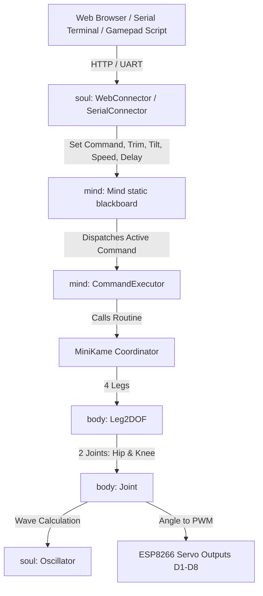

# AGENTS.md

## Project Overview

**FairyKame** (`fairyKame`) is an open-source firmware and hardware project for a 3D-printed quadruped (spider/lizard-style) robot.
- **Lineage:** FairyKame is a modular fork of [fatKame](https://github.com/Blomdoft/fatKame), which itself derives from Javier Isabel's [miniKame](https://github.com/JavierIH/miniKame).
- **Core Focus:** Clean, modular, layered code organization designed to make it easy to create and customize robot gaits and poses, while supporting remote control over Wi-Fi (HTTP) and USB Serial. Ultrasonic sensor and autonomous roaming features from fatKame were removed to keep the scope focused and lightweight.
- **Branching Strategy:** The active development branch is `develop`. All feature, bugfix, and documentation branches must branch off and open pull requests targeting `develop`.

---

## Hardware Specifications & Pinout

- **Microcontroller:** ESP8266 (NodeMCU v2).
  - *Architecture Note:* ESP8266 lacks Bluetooth hardware; migration to an ESP32 SoC is tracked on the roadmap for native wireless Bluetooth Serial (SPP) control (see [TODO.md](TODO.md)). External adapters/modules (e.g. HC-05/HC-06) are intentionally excluded.
- **Toolchain / Build System:** PlatformIO (`platform = espressif8266`, `board = nodemcuv2`, `framework = arduino`).
- **Actuators:** 8 micro-servos (SG90 or compatible; 2 DOF per leg: hip/spread and knee/height).
- **Chassis / Mechanicals:** 3D-printed chassis parts located in `parts/scad/` and `parts/stl/`.

### Pin & Joint Assignments

| Leg | Joint | NodeMCU Pin | ESP8266 GPIO | Direction | Function |
| :--- | :--- | :--- | :--- | :--- | :--- |
| **Front Left** | Hip (Spread) | `D1` | `GPIO5` | Clockwise (+1) | Lateral leg rotation |
| **Front Left** | Knee (Height) | `D8` | `GPIO15` | Clockwise (+1) | Vertical leg elevation |
| **Front Right** | Hip (Spread) | `D4` | `GPIO2` | Counter-clockwise (-1) | Lateral leg rotation |
| **Front Right** | Knee (Height) | `D6` | `GPIO12` | Counter-clockwise (-1) | Vertical leg elevation |
| **Back Left** | Hip (Spread) | `D7` | `GPIO13` | Clockwise (+1) | Lateral leg rotation |
| **Back Left** | Knee (Height) | `D2` | `GPIO4` | Counter-clockwise (-1) | Vertical leg elevation |
| **Back Right** | Hip (Spread) | `D5` | `GPIO14` | Counter-clockwise (-1) | Lateral leg rotation |
| **Back Right** | Knee (Height) | `D3` | `GPIO0` | Clockwise (+1) | Vertical leg elevation |

### Kinematics, Coordinates & Safety Limits

1. **Angular Range & Neutral Pose:**
   - The software coordinate system defines $0^\circ$ as the neutral / resting stance.
   - Permissible joint angles range strictly from $-90^\circ$ to $+90^\circ$.
   - Angle clamping is enforced in `Joint::SetPosition()` to prevent mechanical over-rotation.
2. **Pulse Width Timing:**
   - Standard mapping converts degrees to microsecond pulse widths:
     $$\text{angToUsec}(\theta) \approx 544\,\mu\text{s} \;(-90^\circ) \;\text{to}\; 2400\,\mu\text{s} \;(+90^\circ), \quad \text{center} \approx 1472\,\mu\text{s} \;(0^\circ)$$
3. **Direction Inversion:**
   - Right-side hips/knees and left-side knees have hardware inversion (`_dir = -1` or `+1`) initialized in `Leg2DOF` so that symmetrical software angles produce symmetrical physical movements.
4. **Tripod Stability & Center of Gravity:**
   - When lifting a leg (e.g. `sayHi` or `scratchEar`), the robot must establish a stable tripod base. For `sayHi`, the opposite rear leg pulls inward and knees lower slightly to shift the center of mass over the supporting legs, preventing tipping.

---

## Hardware Encapsulation Rules (Strict)

To ensure seamless future migration to ESP32 (and prevent platform lock-in), the codebase maintains strict encapsulation boundaries:

1. **Wi-Fi Encapsulation:**
   - Only `code/arduino/src/soul/webconnector.h` and `webconnector.cpp` may `#include <ESP8266WiFi.h>` or `<ESP8266WebServer.h>`.
2. **Servo Actuation Encapsulation:**
   - Only `code/arduino/src/body/joint.h` and `joint.cpp` may `#include <Servo.h>`.
3. **Platform-Agnostic Core:**
   - `Mind`, `SerialConnector`, `MiniKame`, `Gaits`, `Leg2DOF`, and `Oscillator` MUST NOT include any ESP8266-specific or servo-specific headers. They must only include `<Arduino.h>` and project-level headers.
4. **Main Entry Point:**
   - `code/arduino/src/main.cpp` orchestrates components and calls `yield()`, avoiding direct coupling to underlying board peripheral libraries.

---

## System Architecture

The firmware (`code/arduino/src/`) follows a layered, anthropomorphic design pattern:



### 1. Body Layer (`code/arduino/src/body/`)
Physical actuation and kinematics:
- **`Joint` (`joint.h`, `joint.cpp`):** Encapsulates an individual servo and its trajectory generator (`Oscillator`). Converts degree targets into pulse width microsecond values (`angToUsec()`), enforces safety limits ($\pm 90^\circ$), and applies reverse direction, trim, and tilt offsets.
- **`Leg2DOF` (`leg-2dof.h`, `leg-2dof.cpp`):** Pairs a hip and a knee joint into a single 2-DOF leg. Implements coordinated walking (shifting knee phase by $\pm 90^\circ$ relative to hip), flexing, static positioning (`pose()`), and zeroing (`relax()`). Synchronizes height and tilt overrides from `Mind`.

### 2. Mind Layer (`code/arduino/src/mind/`)
Coordination, state, and gait definitions:
- **`Mind` (`mind.h`, `mind.cpp`):** Shared static blackboard maintaining global operational state:
  - `activeCommand`: String token for current movement or pose.
  - `heightOverride`: Global trim affecting all knee joints ($\pm 90$).
  - `tiltCorrection`: Differential height adjustment applied between left and right legs ($\pm 90$).
  - `speedModifier`: Speed scaling factor for oscillator periods ($2^{v/2}$).
  - `delay`: Main loop tick delay (ms).
- **`Gaits` (`gaits.h`, `gaits.cpp`):** Movement parameters:
  - `Pair`: Structure storing `{spread, height}` values.
  - `Gait`: Structure storing `{period, amplitude, phase, direction, position}`.
  - Predefined presets: `Gaits::steadyGait(phase, direction)` and `Gaits::steadyShortGait(phase, direction)`.
- **`MoveSpec` & `MoveRegistry` (`movespec.h`, `movespec.cpp`):** Declarative data-driven specification defining `LegMode` (`POSE`, `FLEX`, `WALK`), per-leg kinematic parameters (`LegSpec`), and complete 4-leg postures/gaits (`MoveSpec`). Houses the declarative registry of all 31 standard robot gaits, tricks, and postures, eliminating procedural code sprawl and preparing the spinal cord engine for dynamic over-the-wire move specifications.
- **`CommandExecutor` (`commandexecutor.h`, `commandexecutor.cpp`):** Routes string tokens (`run`, `turnL`, `turnR`, `back`, `stop`, `dance`, `moonWalk`, `magic`, etc.) directly to `MiniKame::executeMove()` via the declarative MoveRegistry.

### 3. Soul Layer (`code/arduino/src/soul/`)
Math, communication protocols, and behavioral rules:
- **`Oscillator` (`octosnake.h`, `octosnake.cpp`):** Mathematical engine generating smooth sinusoidal oscillations:
  $$\text{angle}(t) = A \cdot \sin\left(\frac{2\pi \cdot \Delta t}{T} + \phi\right) + \text{offset} + \text{trim}$$
  Maintains internal phase continuity (`_time_ref`) across period adjustments to avoid mechanical jerking when the speed modifier changes.
- **`WebConnector` (`webconnector.h`, `webconnector.cpp`):**
  - Supports dual Wi-Fi modes:
    - **Station (STA) Mode:** When `secrets.h` (configured from `secrets.example.h`) defines `WIFI_STA_SSID` and `WIFI_STA_PASS`, FairyKame joins the local LAN, registers mDNS responder at `http://fairy.local`, and prints assigned local IP over Serial.
    - **SoftAP Mode (Default / Fallback):** If `secrets.h` is omitted or if Wi-Fi connection times out (10s), falls back to standalone Access Point (`SSID: "MINIKAME"`, open/no password, IP: `192.168.4.1`).
  - Runs HTTP server on port 80 serving an embedded single-page control dashboard (`page_html`).
  - REST endpoints:
    - `/cmd?command=<cmd>`: Update active gait/motion.
    - `/trim?trim=<val>`: Adjust robot height override ($\pm 90$).
    - `/tilt?tilt=<val>`: Adjust lateral tilt ($\pm 90$).
    - `/speed?speed=<val>`: Exponential speed modifier ($2^{v/2}$).
    - `/delay?delay=<val>`: Tick delay in milliseconds.
- **`SerialConnector` (`serialconnector.h`, `serialconnector.cpp`):**
  - Reads single-key commands from Serial UART (115200 baud).
  - Features an integrated **dead-man's switch watchdog**: hold-to-move locomotion keys automatically stop within ~200ms after key release, and the UART FIFO buffer is drained on key events to eliminate buffered command backlog.
- **`ThreeLawsOfRobotics` (`threelaws.h`, `threelaws.cpp`):** Safety stub checking Asimov's Three Laws before any joint command is executed.

### 4. Coordinator & Entry Point
- **`MiniKame` (`minikame.h`, `minikame.cpp`):** Top-level robot coordinator managing all four legs.
- **`main.cpp`:** Initializes modules in `setup()`. In `loop()`, handles web and serial clients, switches commands when `Mind::getActiveCommand()` changes, calls `robot.pulse()`, and regulates loop rate via `delay(Mind::getDelay())` and `yield()`.

---

## Locomotion & Trick Motion Paradigms

Robot actions are divided into two distinct execution classes:

### 1. Momentary / Locomotion Gaits (Hold-to-Move)
- Continuous wave-based gaits driven by `Oscillator` instances stepping in `robot.pulse()`.
- Knee phase is coupled at $\pm 90^\circ$ relative to hip phase for synchronized ground contact and swing.
- Over Serial, these gaits engage the dead-man's switch watchdog and auto-stop when key transmissions cease:
  - `run` (Forward)
  - `back` (Backward)
  - `turnL`, `turnR` (Turning)
  - `upLeft`, `upRight`, `backLeft`, `backRight` (Diagonals)
  - `strafeLeft`, `strafeRight` (Lateral strafing)
  - `turnInPlaceL`, `turnInPlaceR` (Pivot on center)
  - `crawl`, `tiptoe` (Low-profile and elevated walking)

### 2. Persistent / Expressive Tricks & Poses
- Multi-step animations or fixed static postures.
- Run continuously or hold their pose until explicitly stopped or replaced by another command:
  - `dance`, `moonWalk`, `magic`, `jiggle`, `stretch`, `confused`, `pushUps`
  - `sayHi` (Waves front leg while leaning on rear tripod)
  - `scratchEar` (Sits on haunches while scratching)
  - `sit`, `pouncePrep`, `tapFoot`, `playDead`, `shiver`, `recover`, `pack`
  - `stop` / `relax` (Instant neutral stop / zero torque)

---

## Developer Workflows & Commands

### 1. Building Firmware
PlatformIO is configured both at the root (`platformio.ini`) and in `code/arduino/platformio.ini`.
Run the build from the project root or from `code/arduino/`:
```bash
# Recommended command (works regardless of system PATH):
python -m platformio run

# Or if 'pio' is in PATH:
pio run
```

### 2. Uploading / Flashing Firmware
To flash the ESP8266 over USB:
```bash
# Identify port (e.g. COM6 on Windows, /dev/ttyUSB0 on Linux)
python -m platformio run -t upload --upload-port COM6
```

### 3. Wireless Over-The-Air (OTA) Uploading
When FairyKame is connected to your local Wi-Fi in Station mode, you can flash firmware wirelessly:
```bash
# Upload wirelessly via mDNS:
python -m platformio run -e nodemcu-ota -t upload

# With password authentication (if configured in secrets.h):
python -m platformio run -e nodemcu-ota -t upload --upload-flags "--auth=YourPassword"
```
*Note for Windows:* Ensure inbound connections for Python are allowed in Windows Defender Firewall on the Private network profile so the robot can stream the binary.

### 4. Serial Monitor
To monitor serial logs at 115200 baud:
```bash
python -m platformio device monitor -b 115200
```

### 4. Interactive Host Gamepad Controller
The repository includes a dedicated desktop gamepad script that connects to the robot via USB serial:
```bash
# Run controller (auto-detects port or pass explicitly):
python scripts/gamepad_controller.py --port COM6
```
- **Requirements:** `pip install pyserial`.
- **Zero Windows Dependencies:** Uses native Win32 `ctypes` (`GetAsyncKeyState`) for real-time key-up/key-down detection.
- **Controls:**
  - `W` / `A` / `S` / `D`: Forward / Turn Left / Backward / Turn Right
  - `Q` / `E` / `Z` / `C`: Diagonals (also supports pressing `W+A`, `W+D`, etc.)
  - `,` / `.`: Strafe Left / Strafe Right
  - `Space`: Stop / Relax
  - `0`-`9`, `P`, `K`, `H`, `R`, `M`: Expressive tricks and poses

### 5. Git & PR Conventions
- **Base Branch:** Always branch off `develop` and open PRs targeting `develop`.
- **Commit Messages:** Follow Conventional Commits format:
  - `feat(scope): ...` (new feature, gait, controller feature)
  - `fix(scope): ...` (bugfix, kinematics correction)
  - `refactor(scope): ...` (structural / header refactoring without behavior change)
  - `docs(scope): ...` (documentation updates)
- **PR Creation:** Use GitHub CLI (`gh`):
  ```bash
  gh pr create --title "type(scope): description" --body "..." --base develop
  ```

---

## File Structure

```text
fairyKame/
├── AGENTS.md                  # Agent architecture & developer context (this file)
├── README.md                  # Public project documentation & overview
├── TODO.md                    # Project roadmap, planned features & ideas
├── platformio.ini             # Root PlatformIO forwarding configuration for VS Code
├── bridge/                    # AI Model Context Protocol (MCP) host server & bridge
│   ├── README.md              # MCP server documentation & AI client configs
│   ├── __init__.py            # Bridge package init
│   ├── mcp_server.py          # FastMCP / MCPServer tool definitions & runner
│   └── transport.py           # Pluggable transport (Wi-Fi HTTP & USB Serial)
├── code/
│   ├── arduino/
│   │   ├── platformio.ini     # PlatformIO configuration (nodemcuv2, espressif8266)
│   │   ├── lib/               # PlatformIO private libraries
│   │   └── src/
│   │       ├── main.cpp       # Main setup() and loop() entry point
│   │       ├── minikame.h     # MiniKame robot coordinator header
│   │       ├── minikame.cpp   # MiniKame motion & routine implementations
│   │       ├── src.ino        # Empty placeholder for Arduino IDE compatibility
│   │       ├── body/
│   │       │   ├── joint.h    # Joint class header (single servo + oscillator)
│   │       │   ├── joint.cpp  # Joint implementation
│   │       │   ├── leg-2dof.h # 2-DOF leg coordinator header
│   │       │   └── leg-2dof.cpp # Leg implementation & pin mappings
│   │       ├── mind/
│   │       │   ├── mind.h     # Static blackboard state header
│   │       │   ├── mind.cpp   # Static blackboard state implementation
│   │       │   ├── gaits.h    # Gait data structures & presets header
│   │       │   ├── gaits.cpp  # Gait presets implementation
│   │       │   ├── movespec.h # Data-driven MoveSpec and LegSpec definitions
│   │       │   ├── movespec.cpp # Move registry with declarative specs for all moves
│   │       │   ├── commandexecutor.h   # Command router header
│   │       │   └── commandexecutor.cpp # Command router implementation
│   │       └── soul/
│   │           ├── octosnake.h       # Oscillator mathematical engine header
│   │           ├── octosnake.cpp     # Oscillator implementation
│   │           ├── threelaws.h       # Asimov's Three Laws safety stub header
│   │           ├── threelaws.cpp     # Asimov's Three Laws safety stub implementation
│   │           ├── webconnector.h    # HTTP server & SoftAP header
│   │           ├── webconnector.cpp  # HTTP server, endpoints & embedded UI
│   │           ├── serialconnector.h # Serial UART interface header
│   │           └── serialconnector.cpp # Serial keybinding handler & watchdog
│   └── html/
│       └── fatKameCommand.html # Standalone developer template / spec of the web controller UI
├── scripts/
│   ├── gamepad_controller.py  # Interactive game-style keyboard controller (USB Serial)
│   └── test_mcp_bridge.py     # Standalone MCP & transport live verification test
├── doc/
│   ├── data.json              # Documentation metadata
│   └── images/                # Reference diagrams & photos
└── parts/
    ├── scad/                  # OpenSCAD 3D models
    └── stl/                   # 3D printable STL files
```

---

## Technical Notes & Architecture Guidelines

1. **Web Controller Asset Pipeline:**
   - The runtime HTTP server serves the dashboard directly from `page_html` embedded in `code/arduino/src/soul/webconnector.cpp`.
   - `code/html/fatKameCommand.html` serves as a standalone developer template/specification for previewing and modifying UI layout and CSS with proper tooling. Keep any UI modifications in sync between both files (see `TODO.md` for planned automation).
2. **Per-Leg Calibration:**
   - Currently, `TRIM_HEIGHT` and `TRIM_SPREAD` in `leg-2dof.cpp` are set to `0` globally. Implementing persistent per-leg servo trimming (via LittleFS or EEPROM) will simplify mechanical zeroing without adjusting servo horns (see `TODO.md`).
3. **Timing & Servo Resolution:**
   - Loop delay (`Mind::getDelay()`) directly bounds oscillator resolution. Lower delay yields smoother motion, but if set too low, slower servos cannot keep up with high-frequency updates. Always preserve `yield()` in `main.cpp` for ESP8266 background Wi-Fi stack processing.
4. **PlatformIO on Windows:**
   - If `pio` is not on the Windows system PATH, always invoke PlatformIO via `python -m platformio`.
5. **Roadmap & Pending Improvements:**
   - Refer to [**`TODO.md`**](file:///C:/Users/Jinnie/Play/fairyKame/TODO.md) for tracked enhancement ideas, gait extensions, and hardware abstraction plans.
