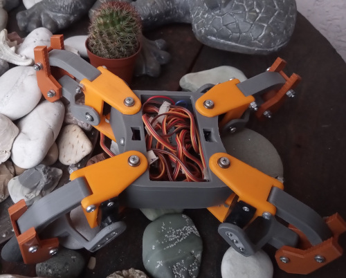
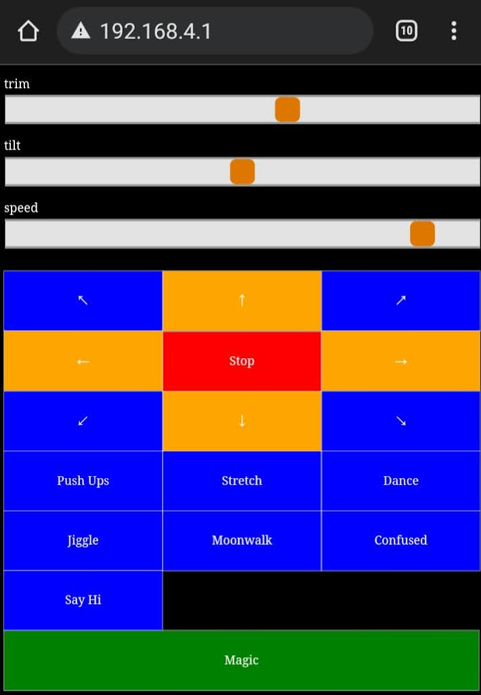

# 🧚 Kame (FairyKame)

<p align="center">

</p>

Hi!

FairyKame is a fork of the great [fatKame](https://github.com/Blomdoft/fatKame) project, which adds a nice layer of code organization on top of the magnificent [miniKame](https://github.com/JavierIH/miniKame) robot. I am forking it with the idea to rework the code even more, in a way that will allow for very easy modification of the current gaits and moves and creation of new ones. I want to try building a community around it, so I am opening the Issues section for all to comment, request features, report bugs. There I will be adding my ideas as feature request issues. Any contribution, as new issues, or code, especially with new gaits and robot moves are more than welcome.
If you have any questions, please post them to the Issues for now. If needed, I'll open the Github Discussions later.
I will also be dropping fatKame's sonic sensor support and auto mode for now, they belong better there, and as I'll be adding a lot of new code, I need to reduce the scope a little bit.

# Goals

## Give More Control
More and finer control over robot movements and position. Adding sliders to control:
- Height (trim) - make it go up or down with the touch of a button.
- Tilt - allow to walk on uneven survace.
- Speed - you can make it sprint or walk in slow motion.

<p align="center">

</p>

## Make it Easy:
Make it easy for everyone, with even little coding skills, to create new gaits and moves.
```CPP
void MiniKame::just_walk()
{
    this->frontLeftLeg->walk(Gaits::steadyGait(0, Gait::FORWARD));
    this->frontRightLeg->walk(Gaits::steadyGait(180, Gait::FORWARD));
    this->backLeftLeg->walk(Gaits::steadyGait(180, Gait::FORWARD));
    this->backRightLeg->walk(Gaits::steadyGait(0, Gait::FORWARD));
}
```
Do you already have an idea what to change to make it walk backwards? Yes, you only need to change `Gait::FORWARD` to `Gait::BACKWARD`. Any ideas how to make it turn right? :) 

Explore what we already have here: [minicame.cpp](https://github.com/Jinnie/fairyKame/blob/develop/code/arduino/src/minikame.cpp)

## Foster Community:

Foster a positive community around the Kame family of robots.

See our contribution guide below.

# Stretch Goals
- Improve on the control app.
- Improve the control app even more. Try to create Android/iOS app (in React Native) which controls the robot over BT.
- Experiment in creating lighter, smaller body.
- Abstract the control board - make it possible to alternatively use ESP32 and even explore building for Raspberry Pi.

# Setup guide:

- Set wifi id and password in [webconnector.cpp](https://github.com/Jinnie/fairyKame/blob/develop/code/arduino/src/soul/webconnector.cpp)
- If needed, finely calibrate your robot by setting trim height (for robot height) and trim spread (legs angle) in [leg-2dof.cpp](https://github.com/Jinnie/fairyKame/blob/develop/code/arduino/src/body/leg-2dof.cpp).
- You can build/deploy in PlatformIO, or in the Arduino dev environment (not tested, but should work, feedback is welcome if you try it)

# Contribution guide:

There is no small contribution. Anything counts - a question, vague idea, anything. Post your thoughts as Issues and we'll get in discussion about them.

- Explore basic command options at [minicame.cpp](https://github.com/Jinnie/fairyKame/blob/develop/code/arduino/src/minikame.cpp). Create your own combinations of gaits, phases, directions.
- Explore the gait objects in [gaits.cpp](https://github.com/Jinnie/fairyKame/blob/develop/code/arduino/src/mind/gaits.cpp). They give you more control over the robot then the basic moves. If you want a more rapid move, or longer steps, that's the place to go.
- Suggest your own modifications on the robot body, or share ideas.
- If you want to commit code then: create your own fork, make modifications against it, submit Pull Request. Or contact me for help.
- Be patient. Open source contribution may take a bit more time and and conversation.
- If you have ideas that are diverging from ours, or we're not accepting yours, fork and go! Respect the License.

# More Info and Pictures

For details on the bot, please take a look at the [splendid original miniKame](https://github.com/JavierIH/miniKame).

Please visit fatKame's Thingiverse page:
http://www.thingiverse.com/thing:1483635

# License

Relative of [fatKame](https://github.com/Blomdoft/fatKame), [miniKame](https://github.com/JavierIH/miniKame) and [Kame](https://github.com/JavierIH/kame)

<p align="center">

</p>

# Other

Total chillout-hobby project
