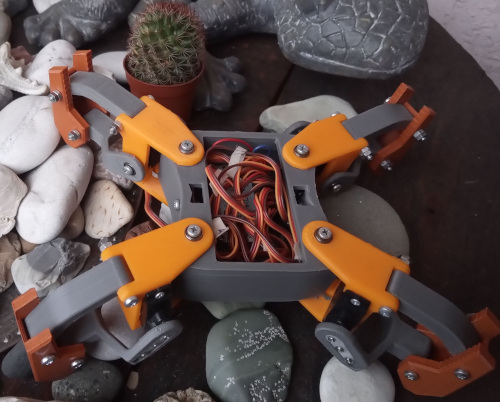
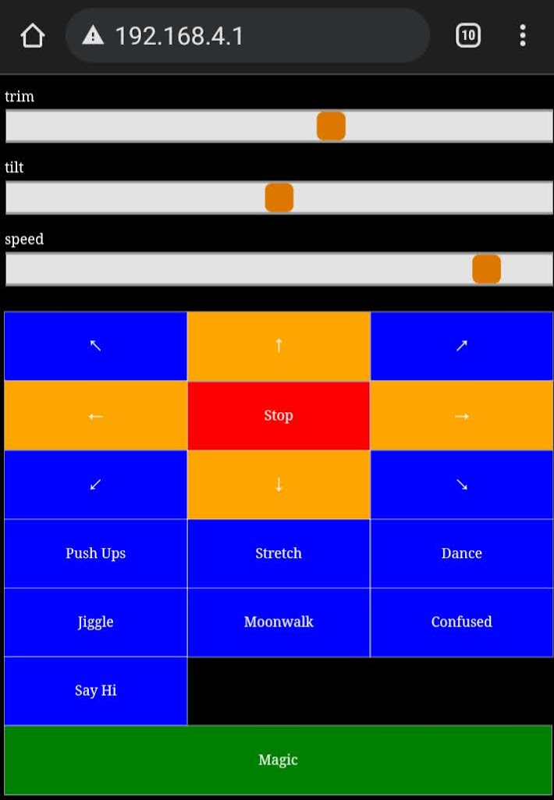

# 🧚 Kame (FairyKame)

<p align="center">

</p>

Hi!

FairyKame is a fork of the great [fatKame](https://github.com/Blomdoft/fatKame) project, which adds a nice layer of code organization on top of the magnificent [miniKame](https://github.com/JavierIH/miniKame) robot. I am forking it with the idea to rework the code even more, in a way that will allow for very easy modification of the current gaits and moves and creation of new ones. I want to try building a community around it, so I am opening the Issues section for all to comment, request features, report bugs. There I will be adding my ideas as feature request issues. Any contribution, as new issues, or code, especially with new gaits and robot moves are more than welcome.
If you have any questions, please post them to the Issues for now. If needed, I'll open the Github Discussions later.
I will also be dropping fatKame's sonic sensor support and auto mode for now, they belong better there, and as I'll be adding a lot of new code, I need to reduce the scope a little bit.

# Goals

## Give More Control
More and finer control over robot movements and position. Adding sliders to control:
- Height (trim) - make it go up or down with the touch of a button.
- Tilt - allow to walk on uneven survace.
- Speed - you can make it sprint or walk in slow motion.

<p align="center">

</p>

### Control Modes

You can steer and command FairyKame either via Wi-Fi or directly over a USB serial connection:

#### 1. Wi-Fi Web Controller
- Connect to the robot's Wi-Fi network: **`MINIKAME`** (open network, no password by default).
- Navigate to **`http://192.168.4.1`** in your mobile or desktop browser.
- Use the on-screen buttons for directional moves, exercises, and dances, and adjust the sliders to tune height, tilt, and speed in real time.
- **Tip for Phones (Android / iOS):** Because the `MINIKAME` network does not provide internet access, smartphones may automatically ignore the Wi-Fi connection and route browser requests through cellular data instead. If `http://192.168.4.1` fails to load, temporarily **turn off Mobile / Cellular Data** on your phone and tap *"Stay Connected"* when prompted. Also ensure your browser uses `http://` (not `https://`).

#### 2. USB Serial Terminal
Connect FairyKame via USB and open a serial terminal (or PlatformIO Serial Monitor) at **115200 baud**. 

- **Hold-to-Move Controls:** Movement keys support game-style hold-to-move: holding down a key keeps the robot walking via OS repeat, and releasing the key automatically stops the robot after a ~350ms heartbeat timeout (pressing `Space` also stops immediately).
- **Keybindings:**

| Key | Command | Description |
| :--- | :--- | :--- |
| `W` | `run` | Walk forward (hold to move) |
| `S` / `X` | `back` | Walk backward (hold to move) |
| `A` | `turnL` | Turn left (hold to turn) |
| `D` | `turnR` | Turn right (hold to turn) |
| `Q` | `upLeft` | Diagonal forward-left |
| `E` | `upRight` | Diagonal forward-right |
| `Z` | `backLeft` | Diagonal backward-left |
| `C` | `backRight` | Diagonal backward-right |
| `,` | `strafeLeft` | Strafe left (hold to strafe) |
| `.` | `strafeRight` | Strafe right (hold to strafe) |
| `Space` | `stop` | Immediate stop and relax joints |
| `1` | `dance` | Dance |
| `2` | `pushUps` | Push-ups |
| `3` | `sit` | Sit down |
| `4` | `crawl` | Low crawl |
| `5` | `tiptoe` | Stand on tiptoes |
| `6` | `waveGoodbye` | Wave front paw |
| `7` | `tapFoot` | Tap front foot |
| `8` | `playDead` | Play dead flat on ground |
| `9` | `shiver` | Shiver / vibration |
| `0` | `pack` | Pack legs tightly |
| `P` | `pouncePrep` | Cat butt-wiggle pounce prep |
| `K` | `scratchEar` | Scratch ear |
| `H` | `sayHi` | Say hi |
| `R` | `recover` | Self-right / flip over flail |
| `M` / `Tab` | `magic` | Magic strafe move |
| `Enter` | *(prompt)* | Enter any named command string |

#### 3. Interactive Game Controller Script (`scripts/gamepad_controller.py`)
For an authentic, zero-latency computer-game experience with simultaneous keys (like `W`+`A` for diagonal forward-left) and instant 0ms stopping on key release:

```bash
# Control over USB Serial (auto-detects port, e.g. COM6):
python scripts/gamepad_controller.py

# Or specify a port explicitly:
python scripts/gamepad_controller.py --port COM6

# Control wirelessly over Wi-Fi (connected to MINIKAME hotspot):
python scripts/gamepad_controller.py --mode http
```

## Make it Easy:
Make it easy for everyone, with even little coding skills, to create new gaits and moves.
```CPP
void MiniKame::just_walk()
{
    this->frontLeftLeg->walk(Gaits::steadyGait(0, Gait::FORWARD));
    this->frontRightLeg->walk(Gaits::steadyGait(180, Gait::FORWARD));
    this->backLeftLeg->walk(Gaits::steadyGait(180, Gait::FORWARD));
    this->backRightLeg->walk(Gaits::steadyGait(0, Gait::FORWARD));
}
```
Do you already have an idea what to change to make it walk backwards? Yes, you only need to change `Gait::FORWARD` to `Gait::BACKWARD`. Any ideas how to make it turn right? :) 

Explore what we already have here: [minicame.cpp](code/arduino/src/minikame.cpp)

## Foster Community:

Foster a positive community around the Kame family of robots.

See our contribution guide below.

# Stretch Goals
- Improve on the control app.
- Improve the control app even more. Try to create Android/iOS app (in React Native) which controls the robot over BT.
- Experiment in creating lighter, smaller body.
- Abstract the control board - make it possible to alternatively use ESP32 and even explore building for Raspberry Pi.

# Setup guide:

- **Build & Upload with PlatformIO (Recommended):**
  - Install the **PlatformIO IDE** extension in VS Code.
  - Open the repository root folder in VS Code.
  - Connect your robot via USB.
  - Click **Upload** ($\rightarrow$ in the bottom PlatformIO toolbar, or run `pio run -t upload` in the terminal).
  - Open the **Serial Monitor** at 115200 baud (plug icon in toolbar, or run `pio device monitor`).
- Alternatively, you can build/deploy in the Arduino dev environment (open `code/arduino/src/src.ino`).
- Set Wi-Fi SSID and password in [webconnector.cpp](code/arduino/src/soul/webconnector.cpp) (defaults to open AP `MINIKAME`).
- If needed, finely calibrate your robot by setting trim height (for robot height) and trim spread (legs angle) in [leg-2dof.cpp](code/arduino/src/body/leg-2dof.cpp).

# Contribution guide:

There is no small contribution. Anything counts - a question, vague idea, anything. Post your thoughts as Issues and we'll get in discussion about them.

- Explore basic command options at [minicame.cpp](https://github.com/Jinnie/fairyKame/blob/develop/code/arduino/src/minikame.cpp). Create your own combinations of gaits, phases, directions.
- Explore the gait objects in [gaits.cpp](https://github.com/Jinnie/fairyKame/blob/develop/code/arduino/src/mind/gaits.cpp). They give you more control over the robot then the basic moves. If you want a more rapid move, or longer steps, that's the place to go.
- Suggest your own modifications on the robot body, or share ideas.
- If you want to commit code then: create your own fork, make modifications against it, submit Pull Request. Or contact me for help.
- Be patient. Open source contribution may take a bit more time and and conversation.
- If you have ideas that are diverging from ours, or we're not accepting yours, fork and go! Respect the License.

# More Info and Pictures

For details on the bot, please take a look at the [splendid original miniKame](https://github.com/JavierIH/miniKame).

Please visit fatKame's Thingiverse page:
http://www.thingiverse.com/thing:1483635

# License

Relative of [fatKame](https://github.com/Blomdoft/fatKame), [miniKame](https://github.com/JavierIH/miniKame) and [Kame](https://github.com/JavierIH/kame)

<p align="center">

</p>

# Other

Total chillout-hobby project
