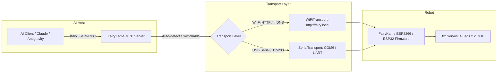

# FairyKame Model Context Protocol (MCP) Server

An open-source, dual-transport **Model Context Protocol (MCP)** bridge allowing AI models (Claude, Antigravity, Cursor, ChatGPT, etc.) to perceive, query, and physically actuate the **FairyKame** 3D-printed quadruped robot.

---

## Architecture Overview

The MCP bridge bridges high-level AI reasoning with low-level robotic kinematics:



---

## Features

- **Dual-Mode Pluggable Transports:**
  - **Wi-Fi (Wireless):** High-speed HTTP REST interface over local LAN via mDNS (`http://fairy.local` or direct IP `192.168.100.101`). Features automatic socket pooling and mDNS caching (<90ms latency).
  - **USB Serial (Tethered):** Low-latency UART interface over USB (e.g. `COM6` on Windows, `/dev/ttyUSB0` on Linux) with automatic hold-to-move keepalive and watchdog protection.
  - **Auto Mode:** Automatically probes Wi-Fi; if unreachable, transparently falls back to USB Serial.
- **Safety First:**
  - All movements enforce physical angle clamping ($\pm 90^\circ$).
  - Locomotion commands automatically stop after their specified duration.
  - Immediate `fairykame_stop()` failsafe tool.
- **Full Kinematic Catalog:**
  - **14 Locomotion Gaits:** Forward, Backward, Turn Left/Right, 4 Diagonals, Lateral Strafing, Pivot on Center, Crawl, Tiptoe.
  - **10 Emotional Gestures & Tricks:** `say_hi`, `dance`, `moonwalk`, `magic`, `jiggle`, `push_ups`, `scratch_ear`, `shiver`, `tap_foot`.
  - **9 Postures:** `sit`, `play_dead`, `pounce_prep`, `stretch`, `confused`, `pack`, `recover`, `stop`, `relax`.
  - **Stance & Posture Trim:** Real-time height squat/stand ($\pm 90$) and lateral roll tilt ($\pm 90$).
  - **Choreography Engine:** Execute multi-step sequences with custom durations.

---

## Quick Start

### 1. Requirements

Ensure dependencies are installed:

```bash
pip install mcp requests pyserial
```

### 2. Standalone Verification Test

Test communication directly without an AI client:

```bash
python scripts/test_mcp_bridge.py
```

### 3. Running the MCP Server

```bash
# Auto-detect transport (Wi-Fi first, fallback to USB Serial):
python bridge/mcp_server.py

# Force Wi-Fi transport:
python bridge/mcp_server.py --transport wifi --url http://fairy.local

# Force USB Serial transport:
python bridge/mcp_server.py --transport serial --port COM6
```

---

---

## AI Client Configuration

### 1. Antigravity (AGY) — Native Integration

FairyKame is natively packaged for **Antigravity (AGY)**!

#### Option A: Built-in Workspace Plugin (Zero Configuration!)
This repository already includes the native plugin at [`.agents/plugins/fairykame/`](file:///C:/Users/Jinnie/Play/fairyKame/.agents/plugins/fairykame/):
- Antigravity automatically discovers and activates the plugin when opening the workspace.
- Tools (`fairykame_move`, `fairykame_express`, etc.) are directly available to the agent.

#### Option B: Global Configuration
Configured in `~/.gemini/config/mcp_config.json`:

```json
{
  "mcpServers": {
    "fairykame": {
      "command": "python",
      "args": [
        "C:\\Users\\Jinnie\\Play\\fairyKame\\bridge\\mcp_server.py",
        "--transport",
        "auto"
      ]
    }
  }
}
```

You can verify active MCP servers in the Antigravity UI under **Additional Options (...) > MCP Servers**.

---

### 2. Claude Desktop

Add FairyKame to your Claude Desktop configuration file:
- **Windows:** `%APPDATA%\Claude\claude_desktop_config.json`
- **macOS:** `~/Library/Application Support/Claude/claude_desktop_config.json`

```json
{
  "mcpServers": {
    "fairykame": {
      "command": "python",
      "args": [
        "C:\\Users\\Jinnie\\Play\\fairyKame\\bridge\\mcp_server.py",
        "--transport",
        "auto"
      ]
    }
  }
}
```

---

## Exposed MCP Tools Reference

| Tool Name | Parameters | Description |
| :--- | :--- | :--- |
| `fairykame_move` | `direction` (str), `duration_seconds` (float, default 1.5) | Drives robot in specified direction (`forward`, `backward`, `left`, `right`, `strafe_left`, `strafe_right`, `crawl`, etc.) then stops. |
| `fairykame_express` | `gesture` (str) | Performs an emotional gesture (`say_hi`, `dance`, `moonwalk`, `magic`, `jiggle`, `push_ups`, `scratch_ear`, `shiver`, `tap_foot`). |
| `fairykame_pose` | `posture` (str) | Commands a static posture (`sit`, `play_dead`, `pounce_prep`, `stretch`, `confused`, `pack`, `recover`, `stop`). |
| `fairykame_posture_trim` | `height_trim` (int: -90..90), `lateral_tilt` (int: -90..90) | Adjusts stance height (squat/stand) and lateral body roll. |
| `fairykame_speed` | `speed_modifier` (int: -5..5) | Sets locomotion oscillator speed (0 is default). |
| `fairykame_stop` | *None* | Immediate emergency stop; zeroes servos to neutral resting pose. |
| `fairykame_status` | *None* | Returns JSON telemetry, latency, transport type, and capabilities. |
| `fairykame_choreography` | `steps` (list of dicts) | Runs an ordered sequence of movements, gestures, and delays. |

---

## Exposed Resources & Prompts

- **Resource `fairykame://telemetry`:** Real-time JSON telemetry (connection health, latency, active transport).
- **Resource `fairykame://kinematics`:** Robot hardware specifications, joint ranges ($\pm 90^\circ$), and physical constraints.
- **Prompt `quadruped_companion`:** Personality instructions giving an LLM an embodied quadruped pet persona (curious, lively, and safety-conscious).
