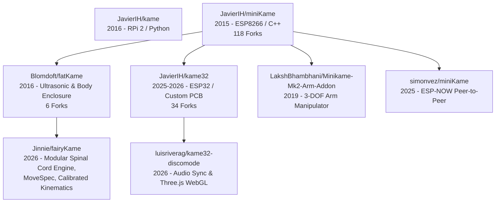

# Ecosystem & Lineage Research: Kame Family Tree

**Date:** September 2026  
**Subject:** Comparative survey of active forks, siblings, and parent repositories in the *miniKame* / *fatKame* / *kame32* ecosystem to identify fresh architectural, kinematic, and feature concepts for **FairyKame**.

---

## 1. Lineage & Repository Map

Over 100 public forks were inspected across GitHub. Roughly 95% of forks dating from 2016–2017 are dormant copies with minor pin or Wi-Fi credential tweaks. However, several modern forks and Javier Isabel's 2025 revival (`kame32`) introduce valuable innovations.

---

## 2. Key Repositories & Findings

### A. [JavierIH/kame32](https://github.com/JavierIH/kame32) (Created April 2025, Active 2026)
*By Javier Isabel (original creator of miniKame/kame).*

1. **Harmonic Knee Oscillation ($2\times$ Frequency):**
   - In [`gamepad.cpp`](https://github.com/JavierIH/kame32/blob/main/code/src/gamepad.cpp), the knee oscillator frequency is doubled relative to the hip:
     $$\text{phase}_{\text{knee}} = \text{phase\_linear} + 2 \times \text{progress}$$
   - **Kinematic Effect:** For each forward/backward stroke of the hip, the knee performs two vertical oscillation cycles. This creates a natural, rhythmic foot-lift and ground-strike curve without complex trajectory math.
2. **Dynamic Center-of-Mass (CoM) Pitch Shift (`body_shift`):**
   - Automatically computes a forward/backward offset proportional to joystick demand:
     $$\text{body\_shift} = \text{step\_amplitude} \times 0.8$$
   - Offsets the hip zero-positions forward when accelerating, leaning the chassis into the direction of travel and counteracting inertial tipping.
3. **Continuous Analog XY Joystick Blending:**
   - Rather than binary directional states (WASD), it accepts continuous analog vectors $(X, Y)$ and dynamically adjusts oscillator amplitudes:
     - When $|Y| \ge |X|$: Drives linear forward/backward amplitude and body shift.
     - When $|X| > |Y|$: Drives angular rotational amplitude with zero body shift.
4. **Interactive Web-Based NVS Servo Trimming:**
   - [`calibration.cpp`](https://github.com/JavierIH/kame32/blob/main/code/src/calibration.cpp) runs an independent HTTP calibration dashboard.
   - Saves 8-servo trim values directly into flash via `ArduinoNvs` (Non-Volatile Storage), ensuring mechanical zeroing survives reboot without reseating physical horns.
5. **Hardware Updates:**
   - Custom PCB shield designed specifically for ESP32 DevKit and 8 servos.
   - Updated 3D chassis incorporating smooth bushings for the pivot hinges.

---

### B. [luisriverag/kame32-discomode](https://github.com/luisriverag/kame32-discomode) (April 2026, MakeSpace Madrid)
*Dancing skills and simulation developed at MakeSpace Madrid.*

1. **Audio-Synchronized Choreography:**
   - Pre-choreographed dance routines locked to specific audio tracks (*Back to the Future*, *Blade Runner*).
   - Demonstrates the potential for expanding FairyKame's Chaplin bread dance and neck massage into musical performances.
2. **WebGL 3D Digital Twin (Three.js):**
   - A browser-based WebGL interface rendering a 3D model of the robot in real time.
   - Allows users to preview and simulate gaits before sending the packets to the physical hardware.

---

### C. [simonvez/miniKame](https://github.com/simonvez/miniKame) (2025)
*Low-latency wireless control.*

1. **ESP-NOW / NRF24L01 Direct Radio Control:**
   - Bypasses standard Wi-Fi station/AP connection overhead by using raw **ESP-NOW** peer-to-peer connectionless packet broadcasting.
   - Delivers sub-5ms wireless latency with zero router or hotspot setup required.

---

### D. [LakshBhambhani/Minikame-Mk2-Arm-Addon](https://github.com/LakshBhambhani/Minikame-Mk2-Arm-Addon) (2019)
*Chassis augmentation.*

1. **3-DOF Top-Mounted Manipulator:**
   - Mounts a lightweight 3-servo arm and gripper on the top plate.
   - Transforms the walking platform into an inspection / mobile manipulation robot.

---

### E. [JavierIH/kame](https://github.com/JavierIH/kame) (2016)
*Original Python prototype on Raspberry Pi 2.*

1. Uses an early Python implementation of `Octosnake`.
2. Serves as historical proof of concept for running gait generators on higher-level host languages (similar to our Python bridge and gamepad controller).

---

## 3. High-Value Ideas for FairyKame

| Idea | Source Repo | Applicability to FairyKame | Complexity |
| :--- | :--- | :--- | :--- |
| **Harmonic Knee Oscillation ($2\times$)** | `JavierIH/kame32` | Can be integrated into `Leg2DOF::walk()` or as a MoveSpec multiplier for rapid, high-clearance trotting. | Low |
| **Dynamic Body Shift (`body_shift`)** | `JavierIH/kame32` | Dynamic CoM forward tilt based on speed/stride amplitude to prevent backward tipping during acceleration. | Low |
| **Flash-Persisted Web Calibration** | `JavierIH/kame32` | Implement using LittleFS on ESP8266 (or NVS on future ESP32) to calibrate servos via web sliders. | Medium |
| **Audio-Synced Choreography** | `kame32-discomode` | Pair MoveSpec execution with timed audio playback in the host Python controller or web UI. | Low |
| **Three.js Digital Twin Preview** | `kame32-discomode` | Standalone WebGL viewer for previewing MoveSpec JSON files visually in browser. | Medium |
| **ESP-NOW Remote Transport** | `simonvez/miniKame` | Alternative ultra-low-latency wireless transport alongside Wi-Fi HTTP and USB Serial. | Medium |
